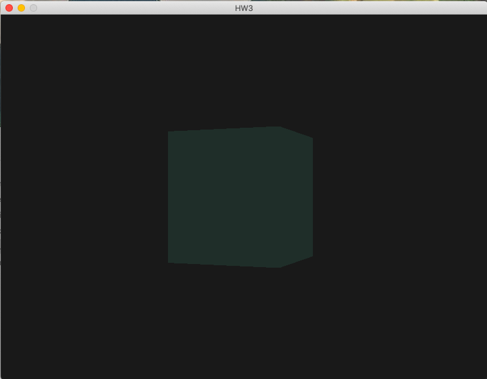
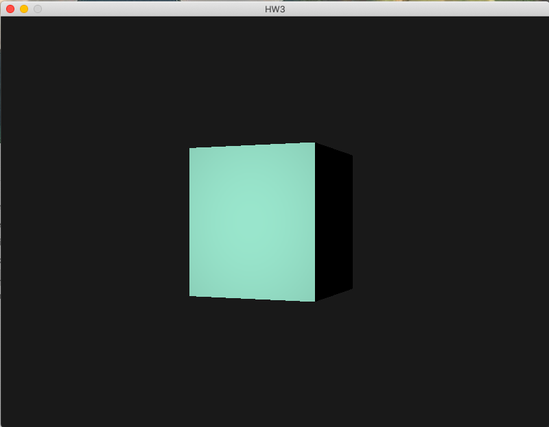
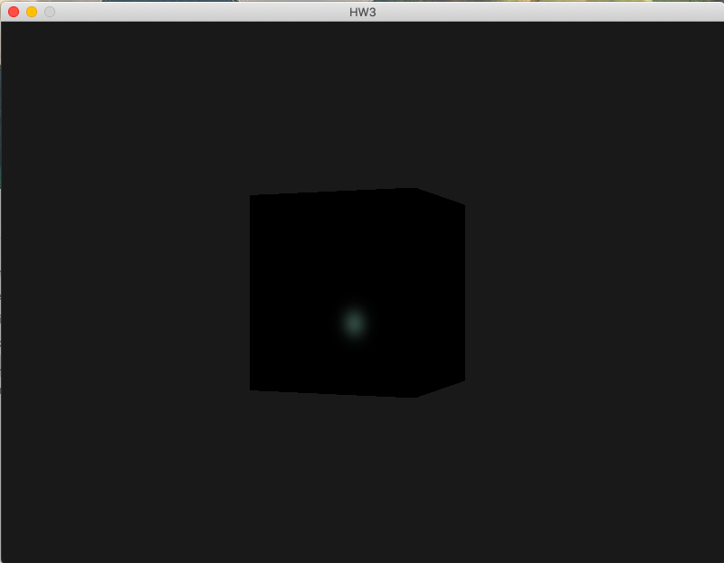
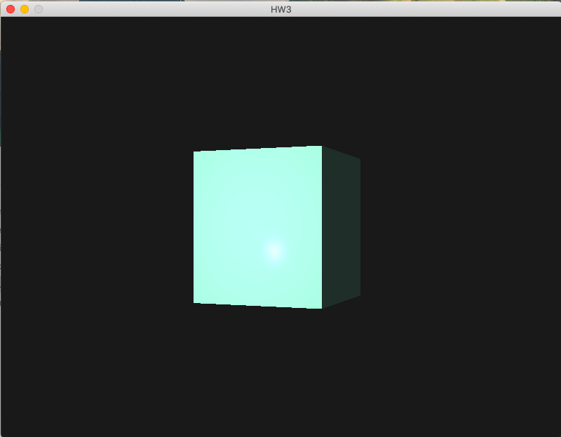

# HW3

## Mengmei He
## PSID: 1850021

### 1. Operaing System:
MacOS 10.15

### 2. IDE:
Xcode

### 3. Details:
1. Vertex Shader:  

(1) Input  
Get coordinate_of_vertex form location 0.  
Get attribute_pointer of vertex from location 1.  
Get model matrix, view matrix, and projection matrix through uniform.  

(2) It defines the "gl_Position", which is the position of the current vertex.  
gl_Position = projection * view * model * coordinate_of_vertex. 

(3) Output 
"Normal direction" of the vertex & "fragment position". 
Normal = inverse(transpose(mat3(model))) * aNormal, where aNormal is the vertex attribute pointers defined in the vertices array. 
Fragment Position(FragPos) = model matrix * coordinate_of_vertex. 

---------------------------
2. Fragment Shader: 

(1) Input 
"Normal" & "Fragment Position(FragPos)" from vertex shader, 
"light Position"(lightPos), "View Position"(viewPos), "light color"(lightColor), & "object color"(objectColor) through uniform. 

(2) Phong Model 
a. Ambient Light:  
ambient = ambientStrength * lightColor, where ambientStrength I set to 0,2. 

b. Diffuse Reflection:  
Color of diffused light is the component that the light has on the normal vector direction.  
--> diffuse = max(dot(lightDir,norm), 0.0) * lightColor,  
where lightDir(light direction) is normalize(lightPos - FragPos), 
and norm is normalize(Normal); 

c. Specular Highlight: 
Specular highlight is to do with the view direction and the direction of the reflected light. It is the component that the reflected light has on the view direction.  
--> specular = specularStrength * pow(max(dot(viewDir, reflectDir),0.0),128) * lightColor, where 
specularStrength = 0.3, 
viewDir = normalize(viewPos - FragPos), 
reflectDir = reflect(-lightDir, norm), 
power is added to improve the effect that the change of vectorial angle b/t viewDir and reflectDir has on the change of specular light strength. 

(3)Output 
FragColor = (ambient + diffuse + specular) * objectColor. 

------------------------
3. Main.cpp 
Passing the parameters the shader files needed through uniform. Do this in the while loop ahead of lightingShader.Use(); 
(1) model: set as identity matrix 
        glm::mat4 M1 = glm::mat4 
        (glm::vec4(1.0,0.0,0.0,0.0), 
         glm::vec4(0.0,1.0,0.0,0.0), 
         glm::vec4(0.0,0.0,1.0,0.0), 
         glm::vec4(0.0,0.0,0.0,1.0)); 

(2) view: call camera.GetViewMatrix(); 

(3) projection matrix: using glm::perspective(fovy,aspect,near,far) 
glm::perspective(100.0f, 1.5f, 3.0f, 150.0f); 
 
(4) light position = (lightPos.x, lightPos.y, lightPos.z)= (1.2f, 1.0f, 2.0f);
        
(5) view position= (camera.Position.x,camera.Position.y,camera.Position.z) = (0.0f, 0.0f, 3.0f);

(6) Color of light = (1.0f,1.0f,1.0f);
        
(7) Color of the cube = (0.6f,0.9f,0.8f);

---------------------
4. Camera: 
GetViewMatrix returns: 
glm::mat4 view = glm::lookAt 
(glm::vec3(x, 0.0, z),  
glm::vec3(0.0, 0.0, 0.0),  
glm::vec3(0.0, 1.0, 0.0));    
where x = sin(glfwGetTime()) * radius, z = cos(glfwGetTime()) * radius. 

Use the time to change the x and z coordinate to make the cube rotate automatically. 

### 4. IMAGES

1. Ambient

2. Diffuse

3. Specular

4.Phong Model

